# News Kotlin Multiplatform App ✨

## Overview

The News KMP App is a Kotlin Compose Multiplatform (KMP) project that aims to provide a consistent
news reading
experience across multiple platforms, including Android

## Screenshot 💻

## Android

<table>
   <tr>
    <td>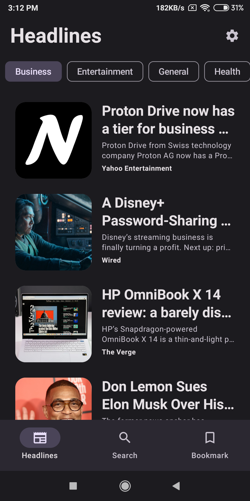</td>
    <td>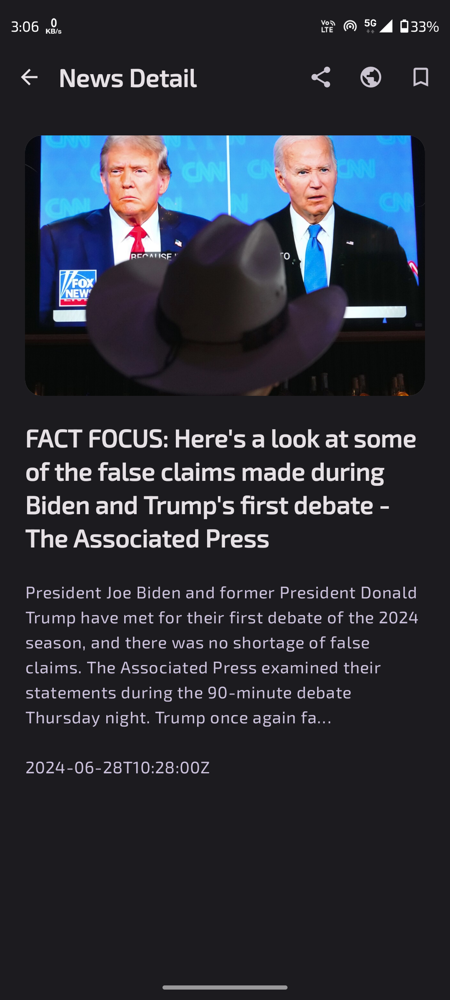</td>
   </tr>
   <tr>
    <td>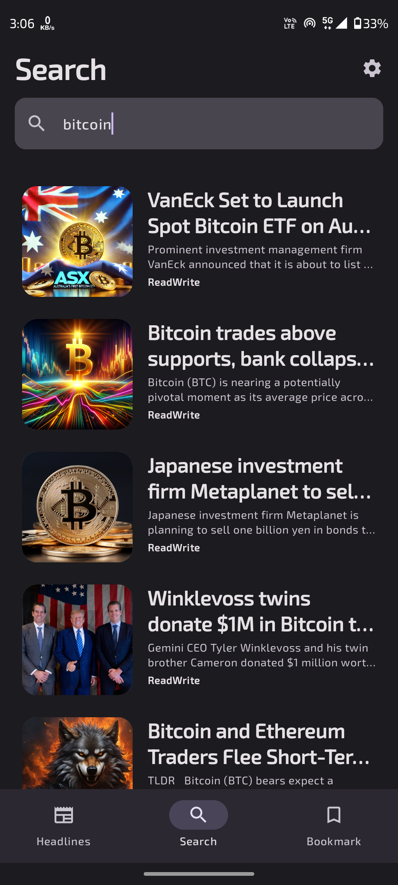</td>
    <td>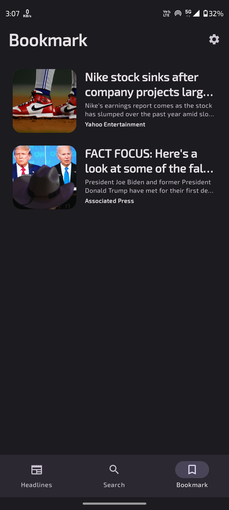</td>
   </tr>
   <tr>
    <td>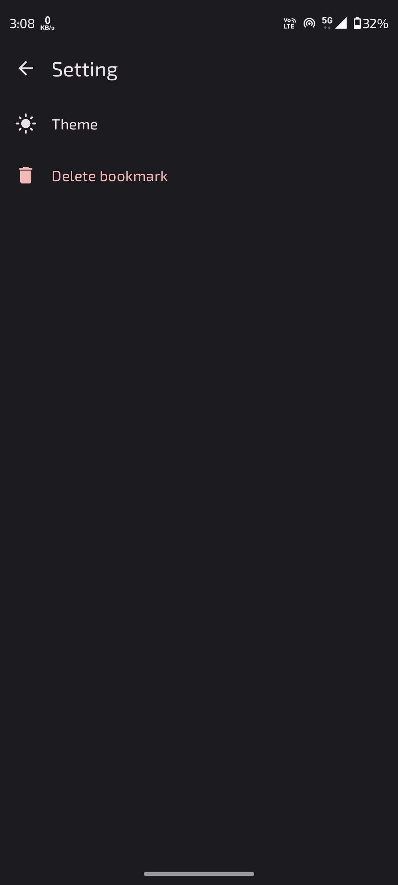</td>
    <td>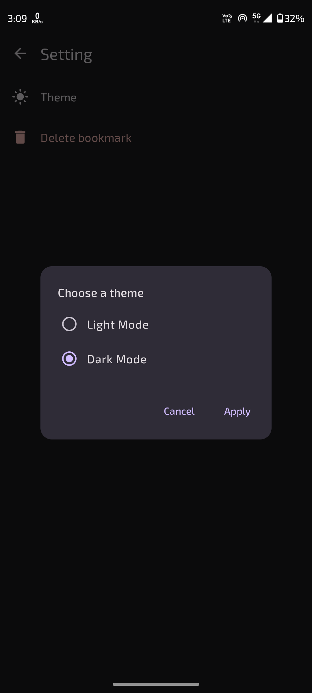</td>
   </tr>
   <tr>
    <td>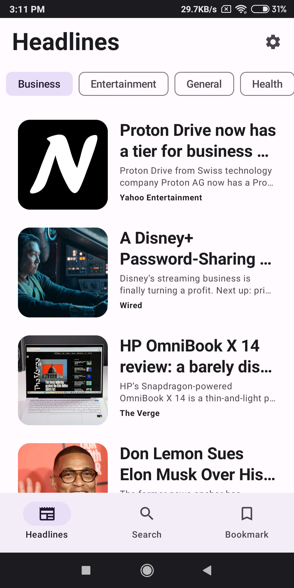</td>
    <td>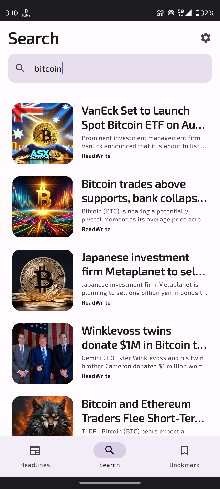</td>
       </tr>
   <tr>
    <td>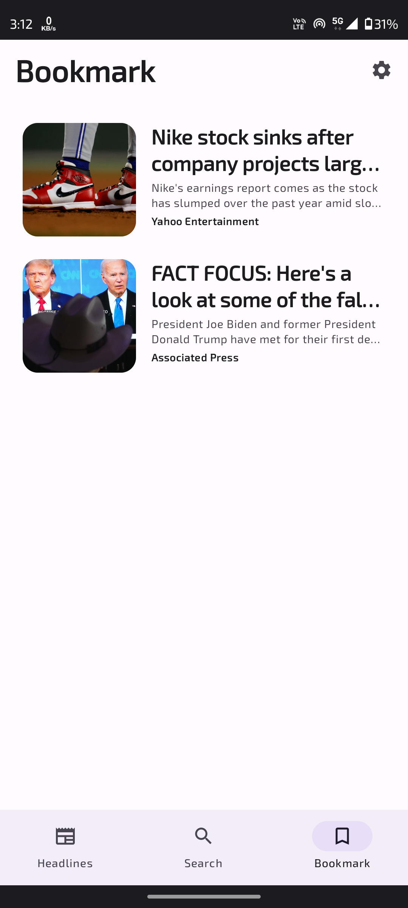</td>
    <td>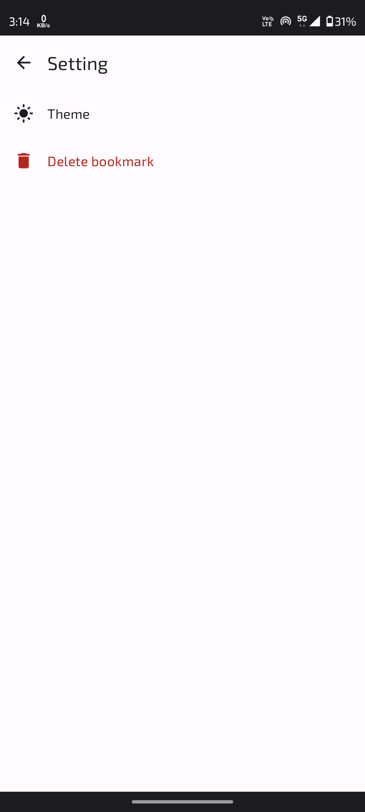</td>
   </tr>
   <tr>
    <td>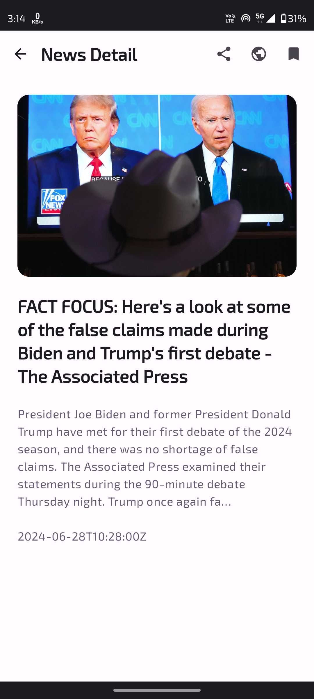</td>
    <td>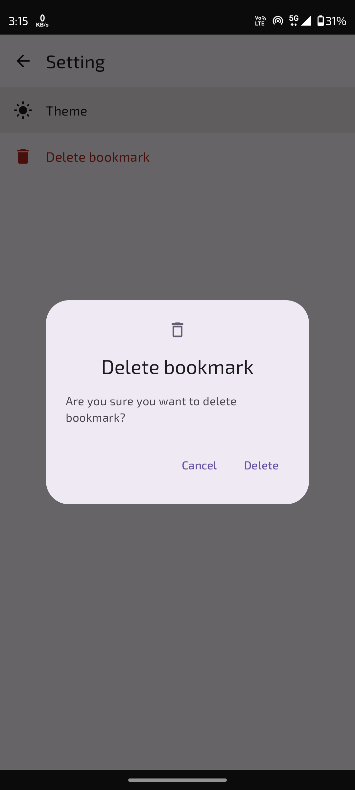</td>
   </tr>
</table>

